# postgres-lro · unpacked

> An interactive, slide-based walkthrough of the **postgres-lro** Go framework — a durable, distributed work queue for Long-Running Operations, built on a single PostgreSQL database.

Click through 14 slides that go from *why this exists at all* → *what's inside* → *how to use it*. Most slides are interactive: live simulations, click-to-explore state machines, animated SQL queries, a step-through claim race, and more.

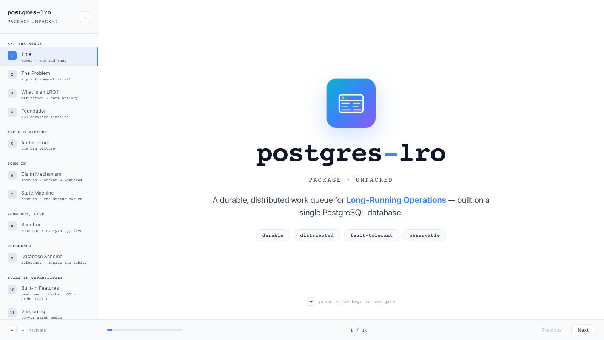

---

## Slide tour

The deck is grouped into seven sections, going from setup → core mechanics → built-in features → developer ergonomics.

### Set the stage

| # | Slide | What it shows |
|---|-------|---------------|
| 1 | **Title** — cover · who and what |  |
| 2 | **The Problem** — why a framework at all | Four pain cards — timeouts, crashes, duplicate work, scary rollouts — with the symptom and root cause for each. 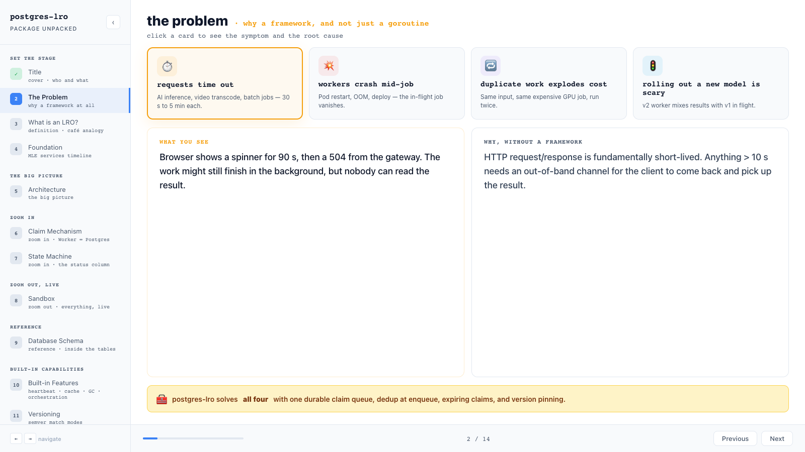 |
| 3 | **What is an LRO?** — definition · café analogy | Formal definition on the left, an animated "café with a buzzer" analogy on the right. 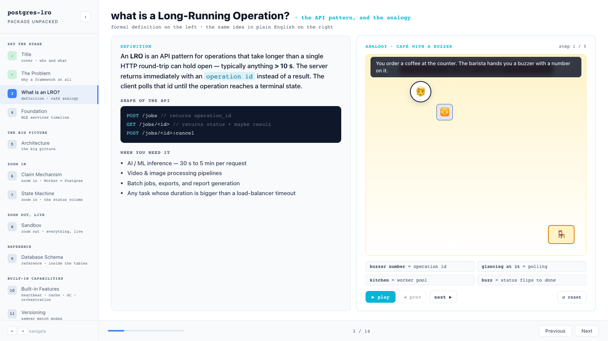 |
| 4 | **Foundation** — MLE services timeline | A 5-year bar chart of every LRO service launched. Click a year to drill in. 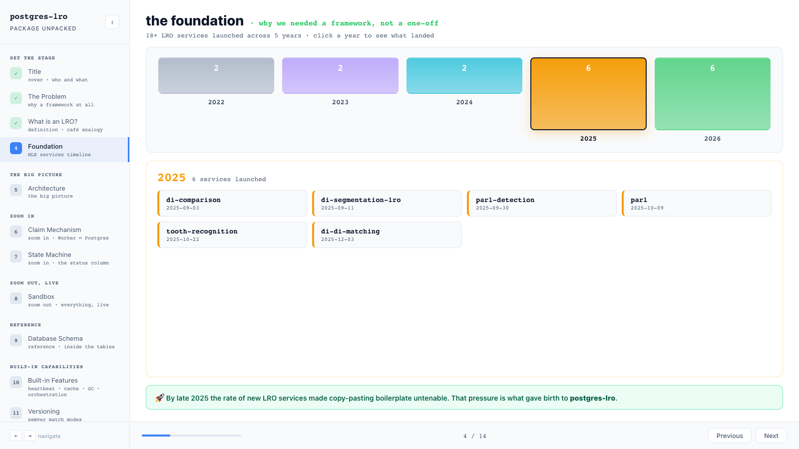 |

### The big picture

| # | Slide | What it shows |
|---|-------|---------------|
| 5 | **Architecture** — the big picture | Interactive end-to-end architecture: Client → Handler → Service → Repository → PostgreSQL → Worker. "Run Flow" sends an animated dot through the system with a live event log. 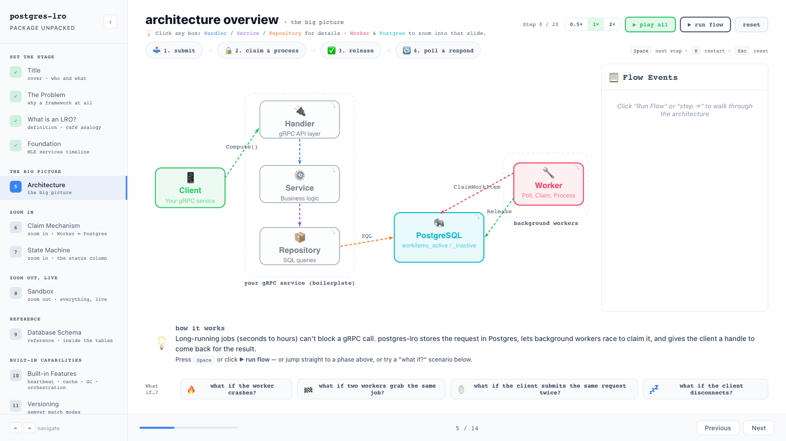 |

### Zoom in

| # | Slide | What it shows |
|---|-------|---------------|
| 6 | **Claim Mechanism** — Worker ↔ Postgres | Three workers race for three work items using `FOR UPDATE SKIP LOCKED`. SQL highlights follow each worker's lock / skip / claim. 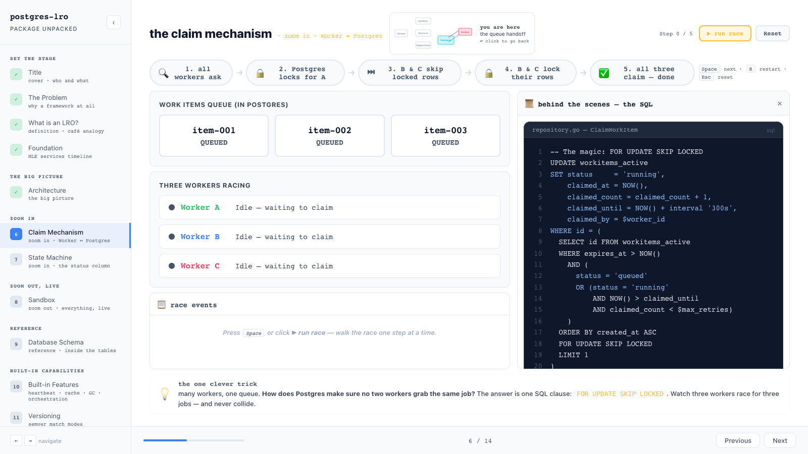 |
| 7 | **State Machine** — the status column | A glowing token sits on the current state. Click action buttons (claim, complete, fail, crash, cancel) to walk the token along its transitions, with a full transition log on the right. 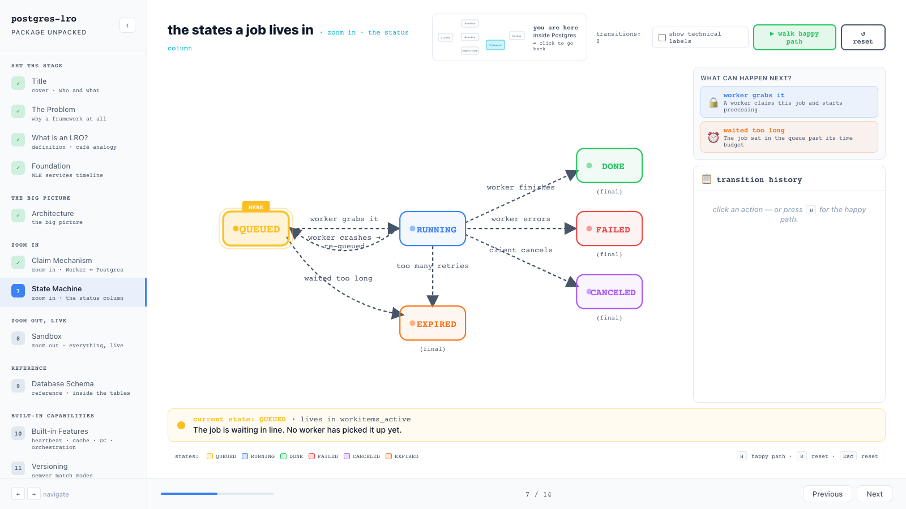 |

### Zoom out, live

| # | Slide | What it shows |
|---|-------|---------------|
| 8 | **Sandbox** — everything, live | The full dashboard: submit/burst jobs, three crashable worker pods, live `workitems_active` / `workitems_inactive` tables, scrolling event log, stats bar. 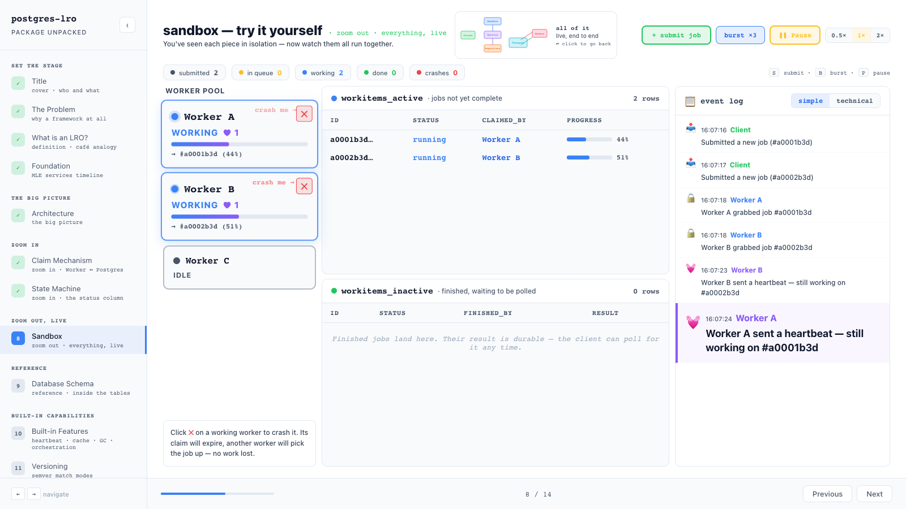 |

### Reference

| # | Slide | What it shows |
|---|-------|---------------|
| 9 | **Database Schema** — inside the tables | Pick a lifecycle stage (queued · running · heartbeat · done · failed) and see the exact column values at that moment, with changed fields highlighted. 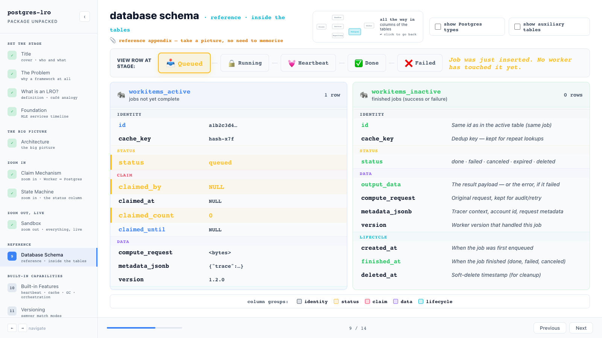 |

### Built-in capabilities

| # | Slide | What it shows |
|---|-------|---------------|
| 10 | **Built-in Features** — heartbeat · cache · GC · orchestration | Four tabs, each with a live visualization: a beating heart (with crash + reclaim), a deduplicating cache hit log, a GC sweep over an inactive table, and a parent op fanning out to children. 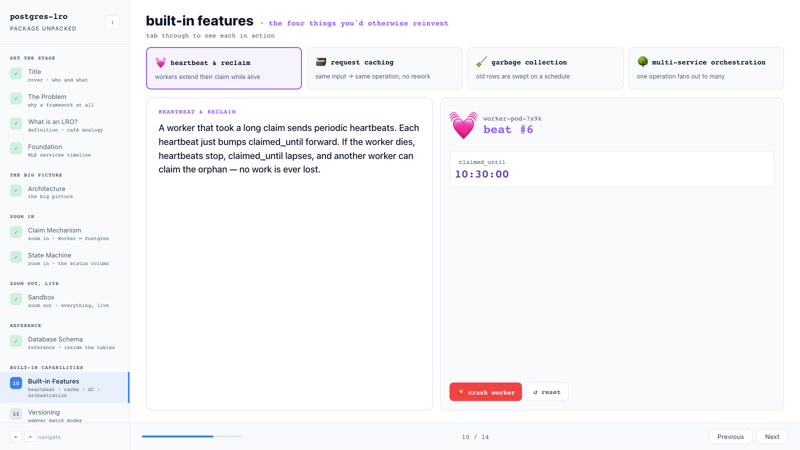 |
| 11 | **Versioning** — semver match modes | Click `AT_LEAST`, `AT_LEAST_EXACT_MAJOR`, `AT_LEAST_EXACT_MINOR`, or `EXACT` to see how each constraint filters the active worker versions and picks the maximum match. 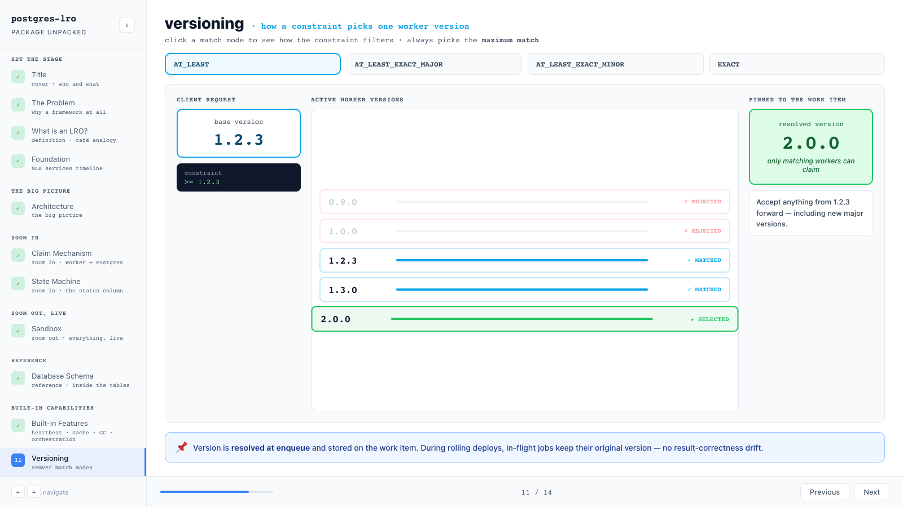 |

### Ship it

| # | Slide | What it shows |
|---|-------|---------------|
| 12 | **How to Use It** — three files, that's the whole service | Real Go snippets for handler setup, request handler, and worker — highlighted lines mark the *only* parts unique to your service. 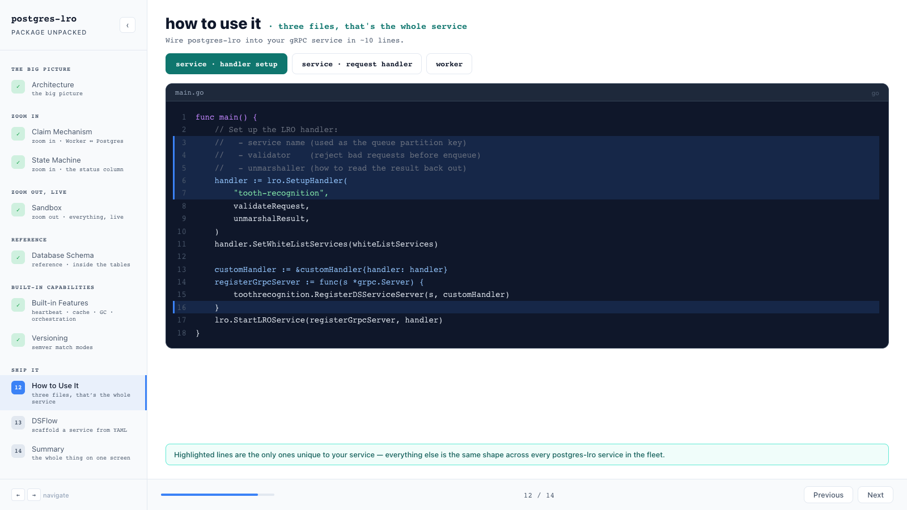 |
| 13 | **DSFlow** — scaffold a service from YAML | One YAML config on the left, the file tree it generates on the right, with a stepper that produces files as you click `generate ▶`. 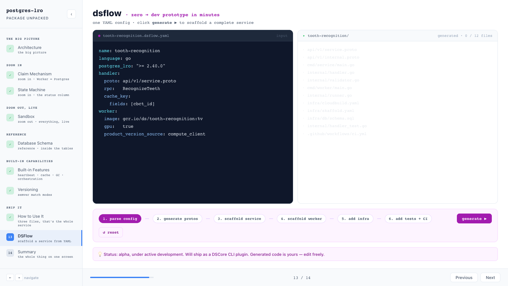 |
| 14 | **Summary** — the whole thing on one screen | Six pillar cards (fault tolerant · fast at scale · safe evolution · observable · self-maintaining · developer friendly) and a closing CTA. 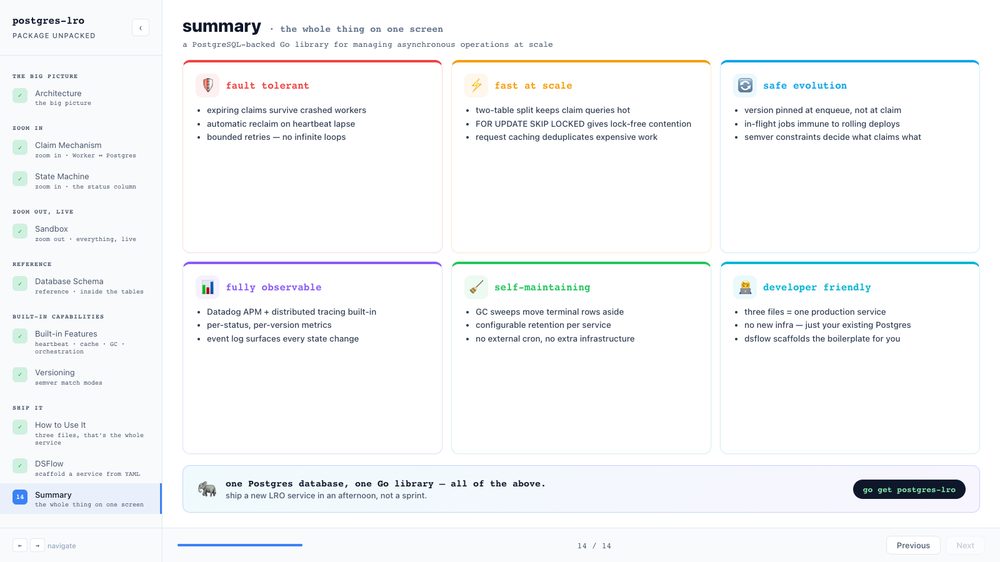 |

---

## Quick start

```bash
git clone https://github.com/<your-username>/postgres-lro-unpacked.git
cd postgres-lro-unpacked
npm install
npm start
# open http://localhost:3000
```

### Navigation

| Key | Action |
|-----|--------|
| `→`, `↓`, `Space` | Next slide |
| `←`, `↑` | Previous slide |
| Sidebar | Jump to any slide |
| `‹` button | Collapse / expand sidebar |

The Architecture slide also responds to its own step controls (look in the top-right of that slide).

---

## Architecture of the app itself

The app is a plain create-react-app + TypeScript + framer-motion bundle. No state management library, no router, no UI kit — every visual is a tiny custom component so the slides stay self-contained.

```
src/
├── App.tsx                # Slide list, sidebar, keyboard navigation
├── App.css                # Layout for sidebar / bottom bar
├── index.css              # Globals (light theme)
├── types.ts               # WorkItem + SlideProps (shared)
├── components/
│   ├── ArchitectureMini.tsx   # "You are here" inset reused on zoom-in slides
│   ├── CodeBlock.tsx          # Syntax-highlighted Go snippets
│   ├── DatabaseTable.tsx      # Animated workitems_active / inactive tables
│   ├── FlowArrow.tsx          # SVG animated arrows
│   └── StatusBadge.tsx        # Pulsing status pills
└── slides/
    ├── TitleSlide.tsx          ─┐
    ├── ProblemSlide.tsx         │  intro
    ├── LROIntroSlide.tsx        │
    ├── TimelineSlide.tsx       ─┘
    ├── ArchitectureSlide.tsx   ─┐
    ├── ClaimMechanismSlide.tsx  │  core mechanics
    ├── StateMachineSlide.tsx    │
    ├── SimulationSlide.tsx      │
    ├── DatabaseSchemaSlide.tsx ─┘
    ├── FeaturesSlide.tsx       ─┐
    ├── VersioningSlide.tsx      │  built-in features
    ├── UsagePatternsSlide.tsx   │  + ship-it
    ├── DSFlowSlide.tsx          │
    └── SummarySlide.tsx        ─┘
```

### How the slide system works

`App.tsx` holds the slide registry — a `slides[]` array of `{ title, component, group, subtitle }`. Each entry is one slide; the order in the array *is* the navigation order. Groups (`'intro'`, `'big'`, `'zoom-in'`, `'zoom-out'`, `'reference'`, `'features'`, `'outro'`) are display-only — they decide how the sidebar is sectioned, not how the slides flow.

Every slide receives the same `SlideProps`:

```ts
interface SlideProps {
  isActive: boolean;                           // gate animations on enter
  goToSlide?: (target: number | string) => void; // jump to another slide
}
```

Slides should:

- Return `null` when `!isActive` so they don't stay live in the background.
- Use `goToSlide('Architecture')` (case-insensitive substring match) to deep-link cross-slide — e.g. the `ArchitectureMini` "you-are-here" inset on the zoom-in slides links back to the full architecture slide.
- Reset their internal state when navigated away (everything in `useState` resets naturally because each slide is unmounted, but timers etc. should be cleaned up in `useEffect`).

### Style conventions

- **Light theme.** Background `#ffffff`, panels `#f8fafc`, text `#0f172a` / `#334155` / `#475569`.
- **One accent colour per slide.** Each slide picks a primary accent (cyan, violet, rose, amber, green, …) and uses it for headings, borders, and key highlights. Keeps each slide visually distinct without changing the whole theme.
- **Monospace for identifiers**, table column names, code, captions. Sans for body copy.
- **Header pattern**: `<motion.h2>` at `fontSize: 28`, paired with a mono subtitle in the accent colour.
- **Pad each slide** with `padding: 24px 32px` and `gap: 12-16` between sections.
- **All animation via framer-motion.** Hover effects use `whileHover={{ y: -2 }}`, taps use `whileTap={{ scale: 0.98 }}`, panel changes use `AnimatePresence mode="wait"`.

### Per-slide colour cheatsheet

| Slide | Accent |
|-------|--------|
| Title | gradient cyan → violet |
| The Problem | amber `#f59e0b` |
| What is an LRO? | cyan `#06b6d4` |
| Foundation | green `#22c55e` |
| Architecture | blue `#3b82f6` |
| Claim Mechanism | rose `#f43f5e` |
| State Machine | violet `#8b5cf6` |
| Sandbox | green `#22c55e` |
| Database Schema | cyan / orange |
| Built-in Features | violet `#8b5cf6` |
| Versioning | sky `#0ea5e9` |
| How to Use It | teal `#0f766e` |
| DSFlow | fuchsia `#a21caf` |
| Summary | neutral slate |

---

## How to add a new slide

1. **Create the file** under `src/slides/MySlide.tsx`. Boilerplate:

   ```tsx
   import React, { useState } from 'react';
   import { motion } from 'framer-motion';
   import { SlideProps } from '../types';

   export const MySlide: React.FC<SlideProps> = ({ isActive, goToSlide }) => {
     if (!isActive) return null;

     return (
       <div style={{ display: 'flex', flexDirection: 'column', height: '100%', padding: '24px 32px', gap: 16 }}>
         <motion.h2
           initial={{ opacity: 0, x: -30 }}
           animate={{ opacity: 1, x: 0 }}
           style={{ fontSize: 28, fontWeight: 800, color: '#0f172a', margin: 0 }}
         >
           my slide
           <span style={{ fontSize: 15, color: '#3b82f6', marginLeft: 12, fontFamily: 'monospace', fontWeight: 600 }}>
             · my subtitle
           </span>
         </motion.h2>

         {/* …your content… */}
       </div>
     );
   };
   ```

2. **Import + register** in `src/App.tsx`:

   ```tsx
   import { MySlide } from './slides/MySlide';

   const slides: SlideMeta[] = [
     // …
     { title: 'My Slide', component: MySlide, group: 'features', subtitle: 'one-line hook' },
     // …
   ];
   ```

   Pick a `group` from the existing set (`intro` · `big` · `zoom-in` · `zoom-out` · `reference` · `features` · `outro`) or add a new one to `SlideGroup`, `GROUP_LABEL`, and `GROUP_ORDER`.

3. **(Optional) deep link to it from another slide**:

   ```tsx
   onClick={() => goToSlide?.('My Slide')}
   ```

4. **Re-capture screenshots** if you want the README gallery updated (see *Regenerating screenshots* below).

---

## Regenerating screenshots

Screenshots live in `docs/screenshots/` and are referenced from this README. To refresh them after a UI change:

1. Start the dev server: `npm start`.
2. Open `http://localhost:3000` at viewport `1600 × 900`.
3. Click each sidebar item in turn and capture the viewport — the slide files are named `NN-<slug>.png` matching the slide order in the README's *Slide tour* table.

**Heads up:** the Architecture slide has its own keyboard step navigation that intercepts `ArrowRight`. When you script the capture loop, navigate via *sidebar clicks*, not `→`, otherwise you'll burn key presses on the Architecture slide's internal stepper instead of advancing.

---

## What is `postgres-lro` itself?

A Go library that gives you a production-grade Long-Running Operations service backed by a single PostgreSQL database. Two sub-modules:

- **`lro`** — the request side: gRPC API surface, durable storage of work items, expiring claims, request caching, version pinning.
- **`worker`** — the worker side: long-polls for work, runs your function, heartbeats while alive, releases the claim when done.

You write three files (handler setup, request handler, worker) and you have a fault-tolerant, observable, version-aware queue service.

That's the thing this deck unpacks.

---

## License

[MIT](LICENSE)
